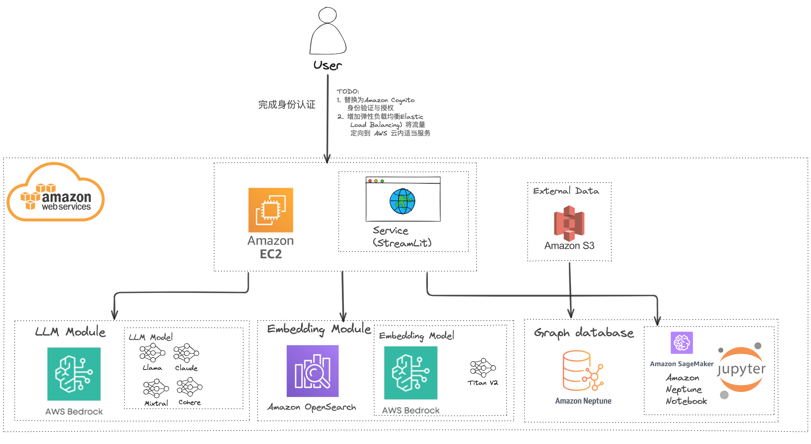

# aws-exercise-FundQA-based-GraphRAG

## Introduction

A  demo using Amazon Bedrock, Amazon OpenSearch, Amazon Neptune Graph Database with GraphRAG technique.

### 项目背景
随着金融市场的快速发展，投资者对基金信息的查询需求日益增长。然而，传统的基金信息查询方式往往需要投资者花费大量时间和精力进行筛选和比较，导致投资效率低下。为了解决这一问题，本项目旨在实现一个基于图数据库和自然语言处理技术的基金信息查询系统，查询基金经理的基本信息和关联的基金信息帮助投资者快速获取基金相关信息，提高投资效率。 

### 架构介绍



1. 用户通过streamlit进行身份验证(后续将换成AWS Cognito,同时增加弹性负载均衡Elastic Load Balancing进行负载均衡)。
4. 经过身份验证的用户访问托管在 Amazon Elastic Compute Cloud(Amazon EC2) 上的前端服务。
7. Embedding模块利用 Amazon OpenSearch 和来自 Amazon Bedrock (Titan) 的嵌入模型来处理和索引数据,以实现高效查询。
8. 托管在 Amazon Bedrock (Llama)将自然语言文本转换为 OpenCypher 查询,使用户能够使用普通语言与数据库交互。
9. 系统从 Amazon S3 和其他第三方集成等客户数据源中提取数据,并用对应的Neptune或OpenSearch进行存储,供给后续查询。

####  项目涉及云服务组件

- Amazon Bedrock
- Amazon OpenSearch
- Amazon Neptune Graph Database
- Amazon Bedrock
- Amazon EC2
- Amazon SageMaker
- AWS Identity and Access Management (IAM)

### 实现功能
基于Amazon 云服务组件的基金检索生成问答系统
- 通过自然语言输入，调用Amazon Bedrock的Llama模型，将自然语言文本转换为OpenCypher完成查询Amazon Neptune图数据库，并返回结果。
- 通过自然语言输入，调用Amazon Bedrock的Titan模型，将自然语言文本转换为向量，并对存储在Amazon OpenSearch中的数据进行检索，以实现高效的文本搜索。
- 将查询结果和检索结果进行整合，通过调用Amazon Bedrock的Llama模型生成最终的答案,返回给用户。

### 项目亮点
- 提供dockerfile，方便快速部署
- 提供streamlit前端页面，方便用户交互
- 实现全部基于Amazon 云服务组件，无需本地部署

### Demo展示 

https://github.com/user-attachments/assets/97a4c897-419b-4bcf-b91b-3fdd302518b5

### 项目结构
```
aws-exercise-FundQA-based-GraphRA
├── Dockerfile 项目打包镜像脚本
├── README.md
├── assets 存放相关资源
├── config_files 存放项目配置信息
│   ├── aws_config.yaml
│   ├── llm_prompt.py
│   └── stauth_config.yaml
├── core 核心流程实现
│   └── chat_service.py
├── data_example 示例数据
│   ├── edge.csv
│   ├── vertex.csv
│   └── vertex2.csv
├── database AWS数据服务
│   ├── neptune.py
│   └── opensearch.py
├── llm AWS Bedrock调用
│   ├── embedding.py
│   └── llm.py
├── main.py 项目入口
├── notebooks 相关notebook文件
│   ├── Titan-V2-Embeddings.ipynb
│   ├── bedrock_invoke.ipynb
│   ├── graph_rag.ipynb
│   ├── inser_data_in_neptune.ipynb
│   ├── insert_embeddding_into_opensearch.ipynb
│   ├── llama_index.ipynb
│   └── neptune-connect.ipynb
├── pages chat页面实现
│   └── chat.py
├── requirements.txt 相关依赖
└── utils 工具资源
    ├── llm.py
    ├── logging.py
    └── pages_config.py
```

### TODO:

1. 用无服务的架构 - 升级ECS托管服务
2. 前置加上ELB负载均衡,认证换成Cognito
3. 密钥存储服务后续换成Amazon Secret Manager
4. 尽量都选用Serverless的架构,例如AWS Fargate、Lambda等

### 过程遇到难点及解决方式
1. 权限问题,各个组件之间的互联互通最初遇到权限问题,无法访问:
    - 学习配置IAM角色,并赋予相应的权限,访问Amazon Neptune Graph Database等云服务组件。
    - 学习配置安全组,并开放相应的端口,以便前端服务能够访问Amazon EC2。
    - 学习配置VPC,并设置相应的子网,以便Amazon EC2能够访问Amazon OpenSearch。
2. 数据导入问题,数据导入Amazon Neptune Graph Database遇到可以查询但是无法写入问题,排查权限问题无误后还是难以写入数据.
    - 学习配置Amazon Neptune Graph Database的权限,并赋予相应的权限,访问Amazon Neptune Graph Database。
    - 学习配置Amazon Neptune Graph Database的VPC,并设置相应的子网,以便Amazon EC2能够访问Amazon Neptune Graph Database。
    - 利用AWS SageMaker托管的Notebook,进行数据导入,并调试代码,最终成功导入数据。后续排查无法写入的原因是EC2的环境配置问题

### 构建过程
1. 首先配置EC2实例,并安装相关依赖
    - 配置信息
    - 配置远程登录和开发环境
2. 配置Amazon S3,并上传数据
2. 配置Amazon Neptune Graph Database,并导入数据
3. 配置Amazon OpenSearch,并导入数据
4. 配置Amazon Bedrock,并申请模型
5. 配置相关安全权限和IAMrole
5. 开发调试代码,并部署服务


### Reference
- 相关文档
    - 官方文档:https://docs.aws.amazon.com/
    - 官方博客:https://aws.amazon.com/cn/blogs/china/
- 相关项目
    - https://github.com/aws/graph-notebook
    - https://github.com/aws-samples/amazon-bedrock-samples